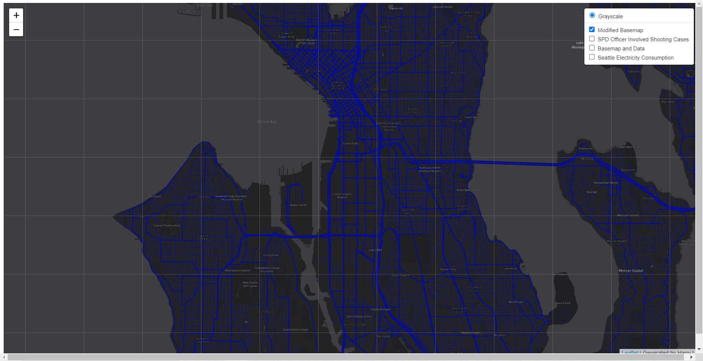
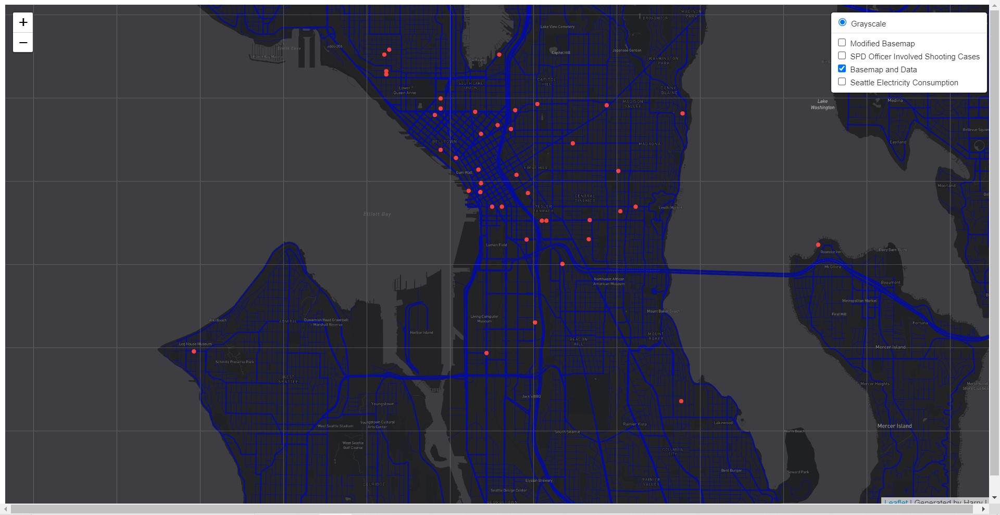
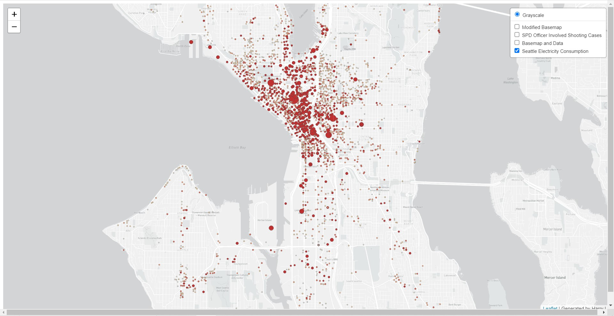

# Map Design and Tiles Generation
Harry Li
May 6, 2022
The map can be accessed by the following url:
https://harry-li21.github.io/Map-design/index.html

## Introduction

This project includes four layers illustrating different tile sets. All tile sets examine the geographic area of Seattle. The first layer is a modified base map, the second layer is a thematic layer with geospatial data. I chose the SPD officer involved shooting cases to be the geospatial data. The third layer is the modified based map combined with the geospatial data. The fourth layer is a map layer design over mapbox, and my design is about Seattle electricity consumption. Furthermore, the map has zoom control function to zoom in and out from the default zoom level, and a layer switcher to turn on and off the layers. 

## Modified Base Map(1st layer)

### Avaliable Zoom Level: 10 - 14

The first tile set is a customized base map made by mapbox studio. I used the color black and blue as the main style of this map because the geosptial data I'm analyzing is SPD officer involved shooting cases. People often think shooting cases will occur in the evening, so I used black as background color, and blue represents police. This is why I think blue and black style base map fit this theme. I used dark color to fill the land and water, and blue to highlight streets and roads. Also, I deleted extra information such as names of small pathways and so on. 

## Geospatial Data(2nd Layer)

### Avaliable Zoom Level: 10 - 14

The second tile set is geospatial data of SPD officer involved in shooting cases. The base map of this layer is just a grayscale base map. All the shooting cases are visualized by red dots.

## Base Map and Data(3rd Layer)

### Avaliable Zoom Level: 10 - 14

The third tile set is base map combined with geospatial data. The data are the same as the second layer, visualized by red dots, while the base map is changed to first layer, modified base map.

## Seattle Electricity Consumption

### Avaliable Zoom Level: 10 - 14

The fourth tile set is a thematic layer visualizing Seattle electricity consumption. Circles on the map represent different buildings and areas than consume electricity. The color ramp from white to red represent incresing electricity consumption. Also, the increasing size of circle represents increasing electricity consumption. 